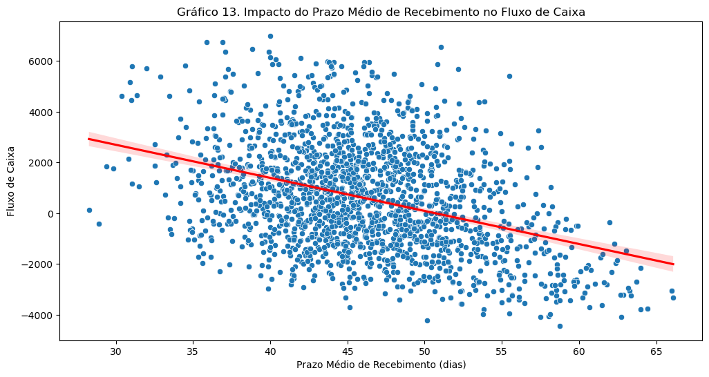
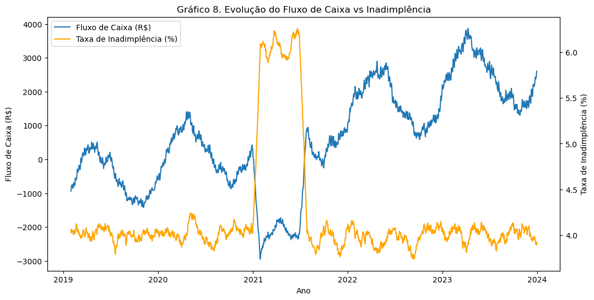
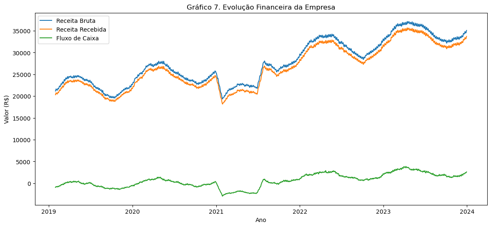
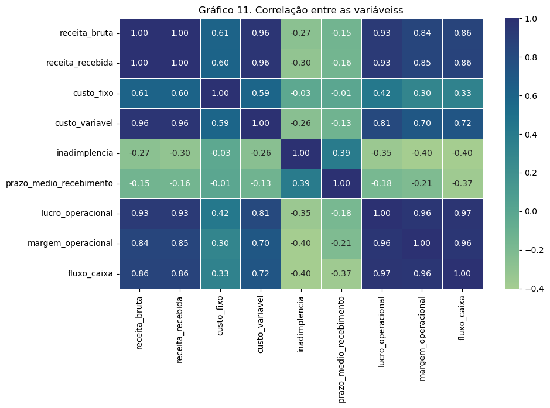

# Análise exploratória de dados de fluxo de caixa
## Contexto
O contexto de negócio envolve uma instabilidade no fluxo de caixa da empresa. Em alguns meses há sobra, já em outros há necessidade de crédito emergencial. Assim, é necessário melhorar a previsibilidade e reduzir custo financeiro da operação.

Este projeto realiza uma análise exploratória de dados (EDA) sobre alguns dados financeiros da empresa, buscando identificar padrões de comportamento e oportunidades de melhoria do fluxo de caixa da companhia.

---

## Objetivo da análise
- Analisar o comportamento histórico do fluxo de caixa.
- Identificar fatores que impactam variações.
- Gerar recomendações estratégicas.

---

## Dataset
O dataset utilizado neste projeto contém registros das vendas da empresa.

Principais variáveis:

| Variável | Descrição |
|--------|--------|
| data | data de referência da observação financeira |
| receita_bruta | valor total de vendas realizadas no dia, antes de descontos, inadimplência ou ajustes |
| receita_recebida | receita efetivamente recebida no dia |
| custo_fixo | despesas fixas diárias (aluguéis, salários, administrativos, contratos fixos) |
| custo_variável | custos diretamente proporcionais ao volume de vendas (logística, comissões, insumos etc.) |
| inadimplencia | percentual da receita bruta que não é recebida |
| prazo_medio_recebimento | tempo médio estimado para recebimento das vendas realizadas |
| fluxo_caixa | resultado líquido diário disponível em caixa |
| indicador_crise | variável binária indicando período de choque econômico |
| dia_semana | dia da semana (0 = segunda-feira, 6 = domingo) |
| mes | mês do ano |
| ano | ano calendário da observação |

Obs: Para fins de demonstração, os dados utilizados são sintéticos.

---

## Metodologia

Etapas da análise:

1. Importação e exploração inicial dos dados  
2. Limpeza e tratamento de inconsistências  
3. Criação de métricas analíticas  
4. Análise exploratória de dados (EDA)  
5. Visualização de tendências e padrões  
6. Geração de insights e recomendações

---

## Principais insights

- **1. Um aumento de aproximadamente 20 dias no prazo médio de recebimento está associado a uma redução, em média, de cerca de R$ 3.000 no fluxo de caixa.**

Quanto maior o tempo que a empresa leva para receber pagamentos de clientes, menor tende a ser a disponibilidade de caixa. Esse resultado indica que políticas de crédito mais flexíveis, que aumentam o prazo de pagamento concedido aos clientes, podem gerar pressões sobre a liquidez da empresa.

- **2. Períodos com maior taxa de inadimplência apresentam deterioração do fluxo de caixa, indicando que a recuperação de crédito é um fator relevante para a saúde financeira da empresa.**

- **3. O fluxo de caixa acompanha o nível de atividade da empresa, com períodos de maior volume de vendas apresentando geração de caixa proporcionalmente maior.**

- **4. Custos fixos apresentam impacto relativamente estável no fluxo de caixa de curto prazo, indicando que a volatilidade do caixa está mais associada a fatores operacionais e variáveis.**

---

## Tecnologias utilizadas

- Python  
    - Pandas
    - Numpy
    - Scipy
    - Matplotlib / Seaborn  
- Jupyter Notebook  

---

## Estrutura do projeto

1. Contexto de negócio
2. Objetivos do projeto
3. Hipóteses
4. Definição e fonte dos dados
    - 4.1. Fonte dos dados
    - 4.2. Dicionário de dados

5. Análise Exploratória dos dados (EDA)
    - Importação e exploração inicial dos dados
    - 5.1. Tendência temporal (Fluxo de caixa)
    - 5.2. Sazonalidade
        - 5.2.1. Sazonalidade por mês
        - 5.2.2. Sazonalidade por dia da semana
    - 5.3. Meses críticos
    - 5.4. Série temporal
    - 5.5. Evolução da inadimplência
    - 5.6. Lucro operacional e Margem operacional ao longo da série histórica
    - 5.7. Drivers do Fluxo de Caixa
        - 5.7.1. Impacto da inadimplência no fluxo de caixa
        - 5.7.2. Impacto do prazo médio de recebimento no fluxo de caixa
        - 5.7.3. Impacto dos custos fixo e variável no fluxo de caixa

6. Principais Insights e Implicações para o Negócio
7. Recomendações Gerenciais
8. Conclusão

## Autor

**Filipe Gomes**

`Data Analyst | Business Intelligence | Data Visualization | Power BI • SQL • Python`

LinkedIn: https://www.linkedin.com/in/filipe-de-souza-almeida-gomes/

GitHub: https://github.com/filipe-sza-gomes 
